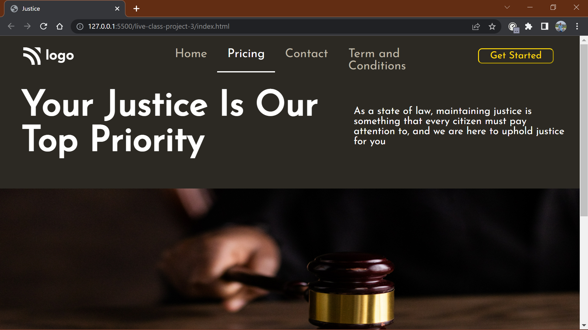
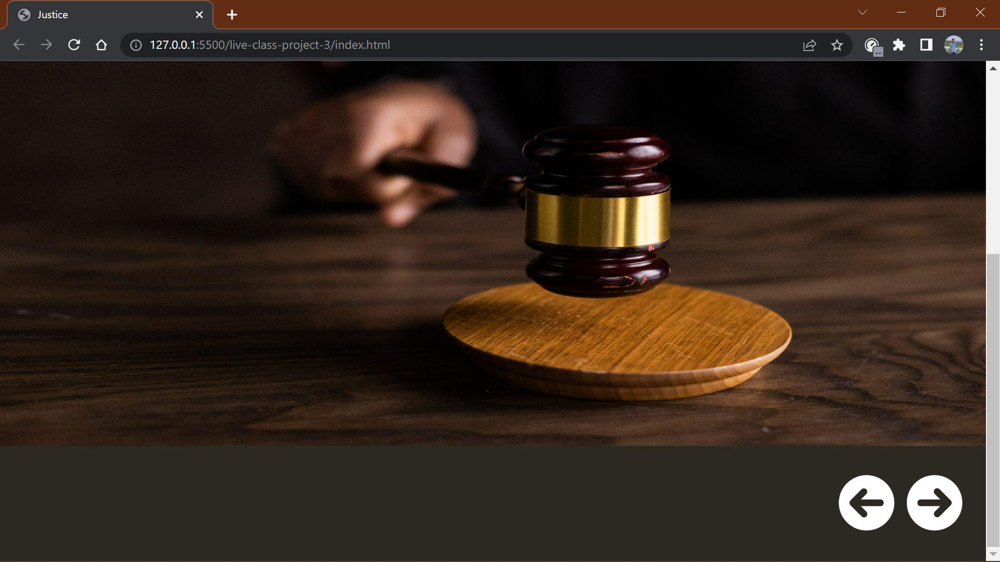

# ASSIGNMENT 3 USING HTML AND CSS

## NAME : NIRAJ VADHER 

In this project I was given the task to make a home page which should look like this

### Target:

### Result:

`ZOOM:100%`
## Learning
In this project i get to learn many thing like
- How to create a navbar
- how to align Text
- how to change Font-family
- how to add hover effect and transition effect to any element
- how to add icons from [FONT AWESOME](https://fontawesome.com/) and how to change this icon as per our referance

## Honest Time of compeletion of project
- `2 hours`

## Live link of project
 - [PROJECT 3](https://tempproject3.netlify.app/)